```{r setup, echo = F}
knitr::opts_chunk$set(
  comment = "#",
  collapse = TRUE,
  warning = FALSE,
  message = FALSE,
  fig.width=5, fig.height=5,
  fig.align = 'center'
)
```

```{r, echo =F}
options(repos=structure(c(CRAN="http://cran.r-project.org")))
```

```{r, include = FALSE}
if (!require(DiagrammeR)) install.packages("DiagrammeR")
library(DiagrammeR)
if (!require(widgetframe)) install.packages("widgetframe")
library(widgetframe)
```


## Preliminary info:


**Ph.D. proposal**

.small[
- Supervisor:  [Dr. Jean-Phillipe Lessard](http://jeanphilippelessard.com/)

.tiny[Department of Biology, **Community Ecology and Biogeography**, Concordia University, Montreal, Canada]

- Collaborator: [Dr. Martin-Nunez](https://scholar.google.com/citations?user=ajiHSOEAAAAJ)

.tiny[**Grupo de Ecología de Invasiones**, Ecotono, INIBIOMA, Universidad del Comahue, Bariloche, Argentina]
]
.pull-left[
.pull-left[

]


.pull-right[
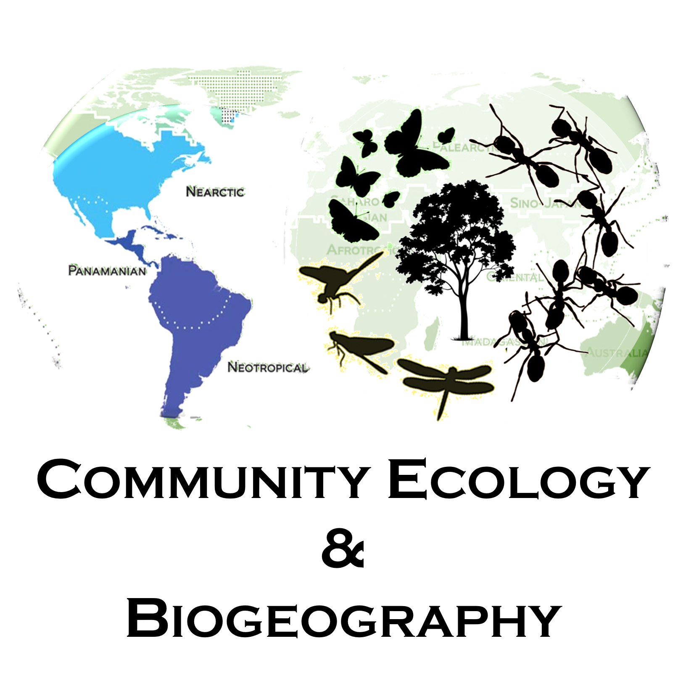
]]

.pull-right[ 
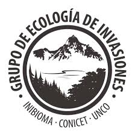
]


------------
*Follow this presentation online at [rebrand.ly/NovelTreeCommunities](https://fgabriel1891.github.io/NovelPineEcosystems/ProposalTalk.html)*


---
class: inverse, center, middle

# Introduction

---
## Human influenced global change

.pull-left[
.small[
Accelerated rate

- Greenhouse emissions
- Land conversion pressures
- Global trade
  ]
  
<br>
<br>
  
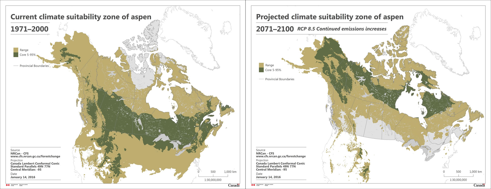

.tiny[*Populus tremuloides* range shifts under the RCP 8.5]
]

.pull-right[ 

.center[


.tiny[Deforestation in Amazon rainforest]

]

.center[

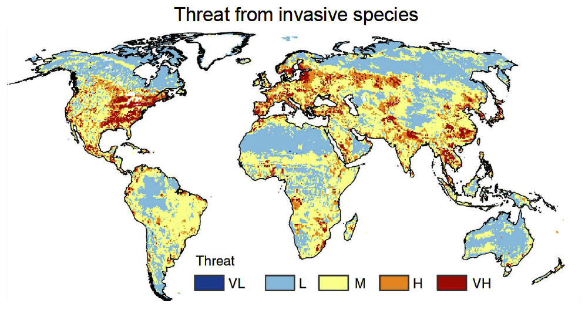 

.tiny[Threat for invasiveness]
]
]

------------
.verytiny[ 

- http://earthenginepartners.appspot.com/science-2013-global-forest
- Sanderson, E.W., Jaiteh, M., Levy, M.A., Redfrod, K.H., Wannebo, A.V. & Woolmer, G. (2002) The human footprint and the last of the wild. Bioscience, 52, 891–904

]

---
## *novel* Ecosystems
.pull-left[
.small[
- Worldwide
- Unique
- Reshape of species combinations
- New ecosystem properties]
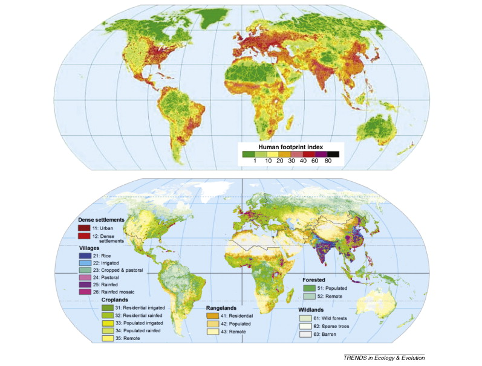

.tiny[Anthropogenic biomes]

]
.pull-right[
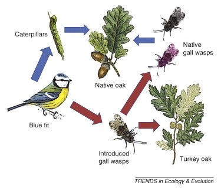

.tiny[New native / non native interactions]
]


------------
.verytiny[ 
- Hobbs, R. J., Arico, S., Aronson, J., Baron, J. S., Bridgewater, P., Cramer, V. A., … Zobel, M. (2006). Novel ecosystems: Theoretical and management aspects of the new ecological world order. Global Ecology and Biogeography, 15(1), 1–7. https://doi.org/10.1111/j.1466-822X.2006.00212.x
]

---
## Community assembly theory
.small[ 
*What shapes the identity and abundace of species within a community?*
]
.small[
- Hierarchically organized stochastic and deterministic processes

- Scale dependant
]

.pull-left[ 


.tiny[Pearson et al. 2018]
]

.pull-right[ 
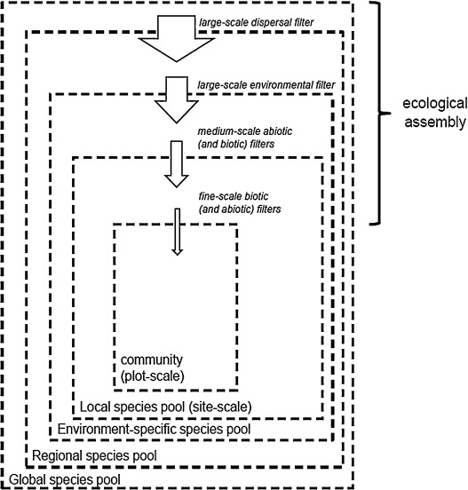

.tiny[ Munoz F. *et al*. 2018]
]


------------
.verytiny[ 
- Pearson, D. E., Ortega, Y. K., Eren, Ö., & Hierro, J. L. (2018). Community Assembly Theory as a Framework for Biological Invasions. Trends in Ecology and Evolution, 33(5), 313–325. https://doi.org/10.1016/j.tree.2018.03.002

- Diamond, J.M. 1975. Assembly of Species Communities, in Ecology and Evolution of Communities (eds. M.L. Cody and J.M. Diamond), Belknap, Harvard, pp. 342-444.]


---
## Trait-based community assembly

.small[
- Reveal generalities & mechanisms across organisms and ecosystems .tiny[(McGill 2006)]
- Traits influence trophic network structure .tiny[(Van der Plas *et al*. 2012; Gravel *et al*. 2016; Laigle *et al*. 2018)]
]
.pull-left[
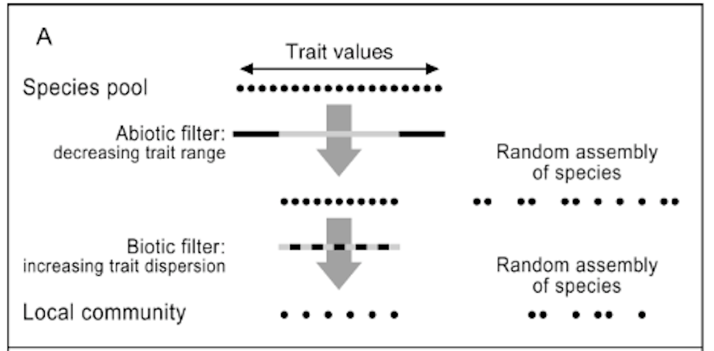

.tiny[Van der Plas *et al*. 2012 ]

.small[need for **multitrophic** approaches (Seibold *et al* 2018)]
]

.pull-right[
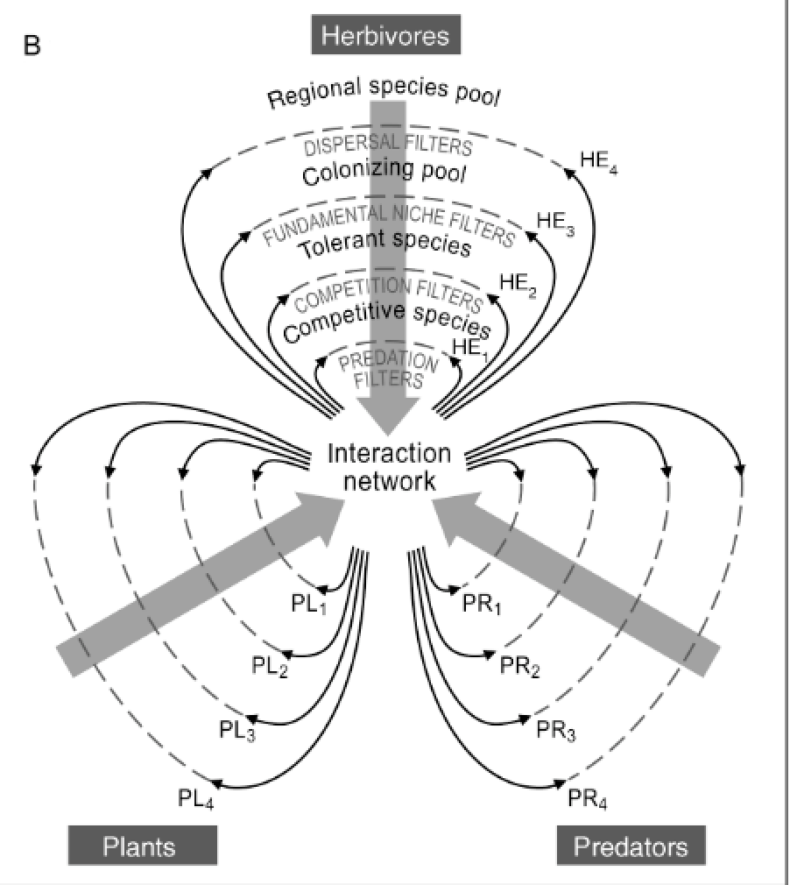

.tiny[Van der Plas *et al*. 2012]
]


------------
.verytiny[ 
- McGill, Brian J., et al. "Rebuilding community ecology from functional traits." Trends in ecology & evolution 21.4 (2006): 178-185.
- Seibold, S., Cadotte, M. W., Macivor, J. S., Thorn, S., & Müller, J. (2018). The Necessity of Multitrophic Approaches in Community Ecology. https://doi.org/10.1016/j.tree.2018.07.001
- Van Der Plas, F., Anderson, T. M., & Olff, H. (2012). Trait similarity patterns within grass and grasshopper communities: Multitrophic community assembly at work. Ecology, 93(4), 836–846. https://doi.org/10.1890/11-0975.1
]

---
## Mountains 

.alert[Mountains are important!]
.small[ 
- Provides goods and services to a global population
- Worldwide centers & historical generators of biodiversity .tiny[(Antonelli *et al* 2018; Flantua 2017)]
- Fragile ecosystems, sensible to alterations
]
.pull-left[
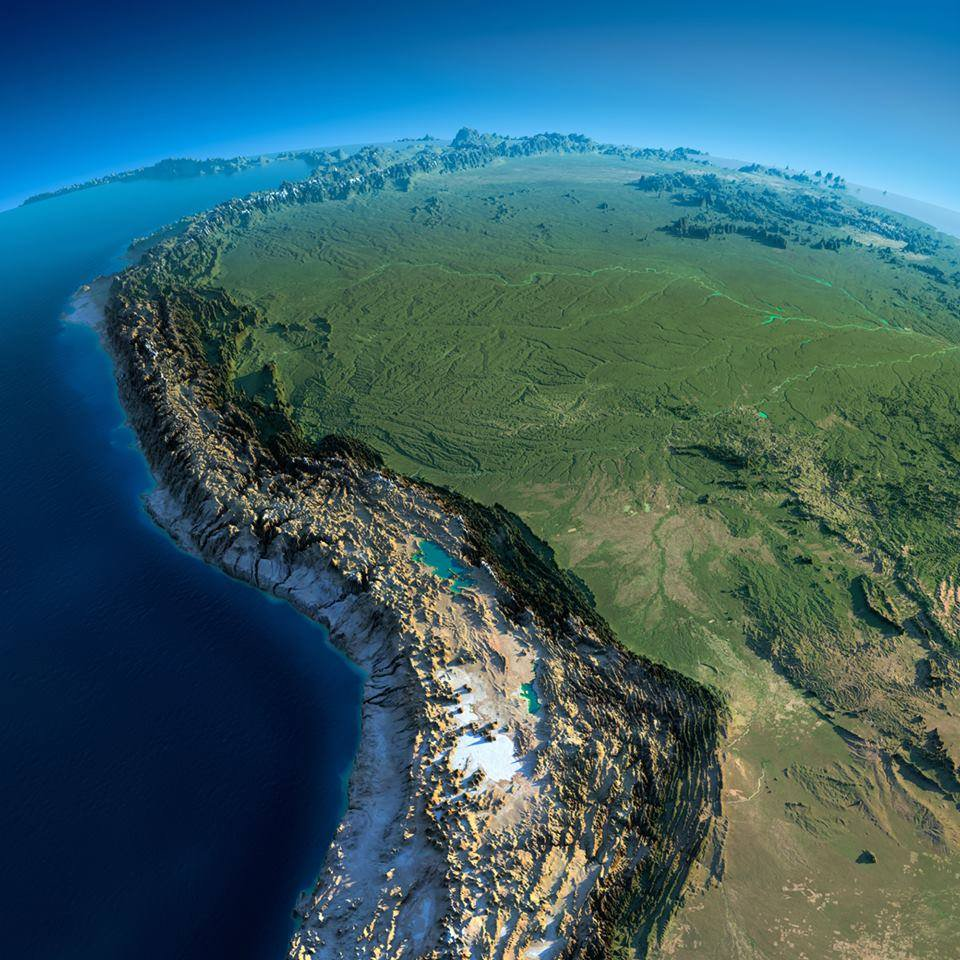]
.pull-right[
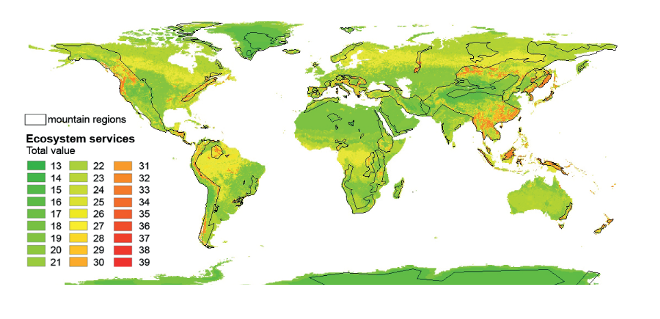
]

------------
.verytiny[ 
- Egan, P. A., & Price, M. F. (2017). Mountain Ecosystem Services and Climate Change. Unesco-Ihp/Mbp. https://doi.org/10.1659/MRD-JOURNAL-D-16-00110.1
- Antonelli, A., Kissling, W.D., Flantua, S.G.A., Bermúdez, M.A., Mulch, A., Muellner-Riehl, A.N., Linder, H.P., Badgley, C., Fjeldså, J., Fritz, S.A., Rahbek, C. Herman, F., Hooghiemstra, H. & Hoorn, C. (2018): Geological and climatic influences on mountain biodiversity. Nature Geoscience, DOI: 10.1038/s41561-018-0236-z
- Flantua, S. G. A. (2017). Climate change and topography as drivers of Latin American biome dynamics. PhD. dissertation. UvA]

---

## *Pinus contorta*

.pull-left[
.small[
- *Pinus contorta* (most invasive species)
- brought and invaded mountain ecosystems worldwide
- few information about mechanisms behind the dynamics of emerging ecosystems
]
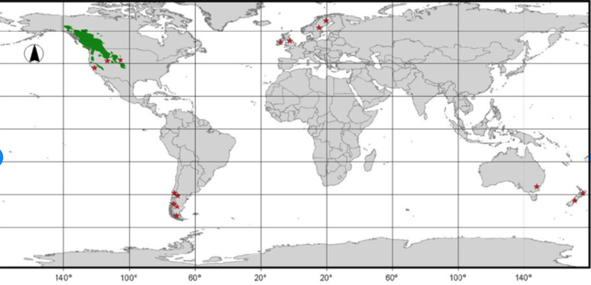

]

.pull-right[
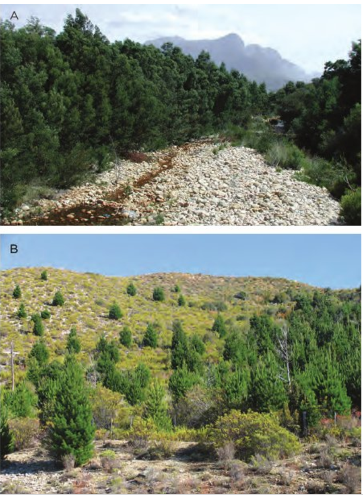

]

------------
.verytiny[ Langdon, B., Pauchard, A., & Aguayo, M. (2010). Pinus contorta invasion in the Chilean Patagonia: local patterns in a global context. Biological Invasions, 12(12), 3961-3971]

---
## Pines in Patagonia 

.small[ 
- Introduced in Patagonia 70's for agroforestry (70 000ha)
- Landscape level consequences in nutrient cycling and biodiversity 
]

.pull-left[
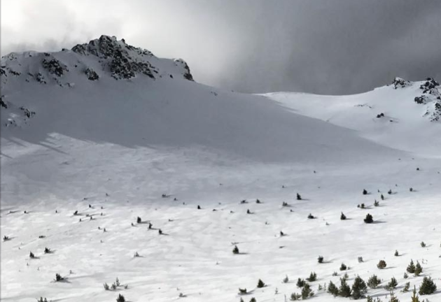
]

.pull-right[
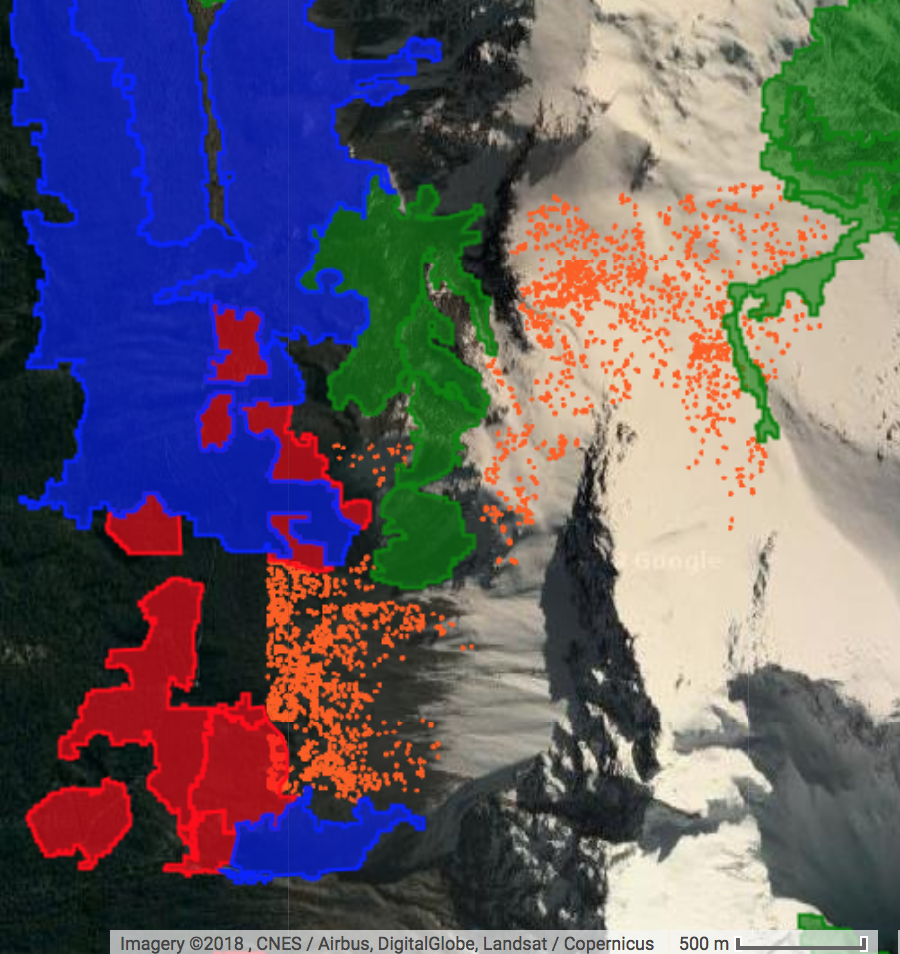
]

---
## Research Questions 

.alert[Q1: what are the mechanisms shaping the assembly of novel treeline communities?]

- what functional traits and/or scale of reference pools explain better the observed novel communities?

- what is the relative contribution of the different community assembly processes (i.e. dispersal assembly, filtering or limiting similarity).

.alert[Q2: are the functional traits determinants of
community assembly also predictors of trophic network structure?]


---
class: inverse, center, middle

# Methods


---
## Workflow


.center[

]

---
## Trait data 
.center[
```{r, echo = F}
trait = read.csv("assets/traitTable.csv", header = T)

makedataSun = function(database){
  dataSun = paste0(database$Taxa,
                   "-",database$Trait.category,
                   "-",database$Trait.type,
                   "-",database$Source)
  
  dataSun = aggregate(dataSun, list(dataSun), length)
  
  return(dataSun)
  
}

sunburstR::sunburst(makedataSun(trait),
                    legend = F,count = T, 
                    width = 600, height = 300)
```
]

<br>
<br>
.alert[
How to account for the variablity across thropic communities? 
]

---
##  H1:

community composition patterns = Traits related to dispersal ability and endurance to harsh climatic conditions pools based on weighted Euclidean distances 

.center[
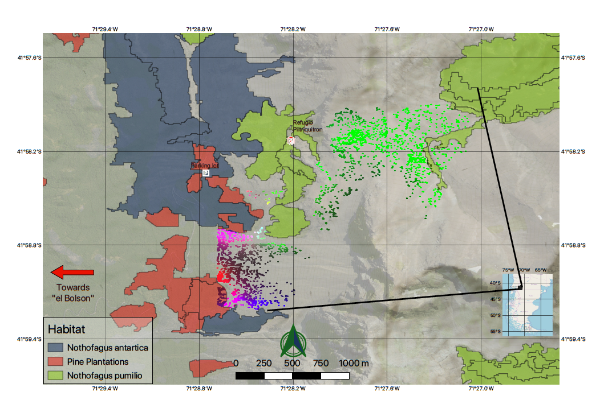
]

.alert[Implications on predictability of novel ecosystems]

---
##  H2: 

Environmental filtering, followed by dispersal assembly plays a higher role than limiting similarity.

.center[
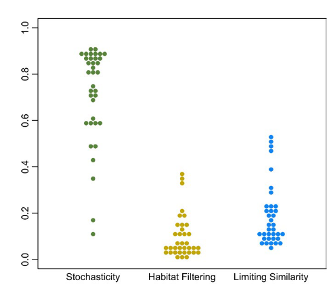]

.alert[Implications on predictability of novel ecosystems]

---
## H3: 

Functional traits will correlate positively with trophic network structural metrics 

.center[
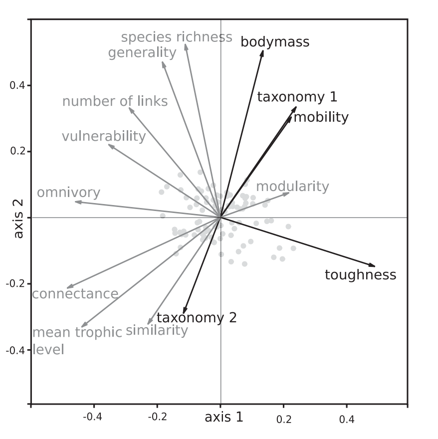]


---
class: inverse, center, middle

# Your Questions? 


---
class: inverse, center, middle

# Extra references 


---
.tiny[
Perronne, R., Munoz, F., Borgy, B., Reboud, X., & Gaba, S. (2017). How to design trait-based analyses of community assembly mechanisms: Insights and guidelines from a literature review. Perspectives in Plant Ecology, Evolution and Systematics, 25, 29–44. https://doi.org/10.1016/j.ppees.2017.01.004

Moretti, M., Dias, A. T. C., de Bello, F., Altermatt, F., Chown, S. L., Azcárate, F. M., … Berg, M. P. (2017). Handbook of protocols for standardized measurement of terrestrial invertebrate functional traits. Functional Ecology, 31(3), 558–567. https://doi.org/10.1111/1365-2435.12776

Díaz, S., Hodgson, J. G., Thompson, K., Cabido, M., Cornelissen, J. H. C., Jalili, A., … Zak, M. R. (2004). The plant traits that drive ecosystems: Evidence from three continents. Journal of Vegetation Science, 15(3), 295–304. https://doi.org/10.1111/j.1654-1103.2004.tb02266.x

Cornelissen, J. H. C. A., Lavorel, S. B., Garnier, E. B., Díaz, S. C., Buchmann, N. D., Gurvich, D. E. C., … Poorter, H. I. (2003). InclusaoDEbAutOi.pdf, 335–380. https://doi.org/10.1071/BT02124

Munoz, F., Grenié, M., Denelle, P., Taudière, A., Laroche, F., Tucker, C., & Violle, C. (2018). ecolottery: Simulating and assessing community assembly with environmental filtering and neutral dynamics in R. Methods in Ecology and Evolution, 9(3), 693–703. https://doi.org/10.1111/2041-210X.12918

Bannar-Martin, K. H., Kremer, C. T., Ernest, S. K. M., Leibold, M. A., Auge, H., Chase, J., … Supp, S. R. (2018). Integrating community assembly and biodiversity to better understand ecosystem function: the Community Assembly and the Functioning of Ecosystems (CAFE) approach. Ecology Letters, 21(2), 167–180. https://doi.org/10.1111/ele.12895
]


